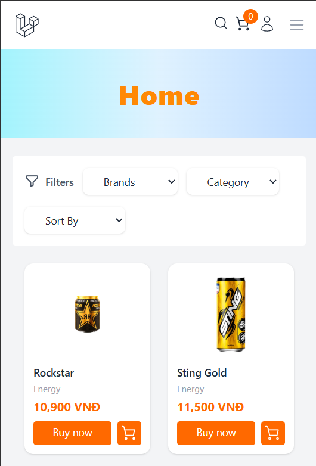
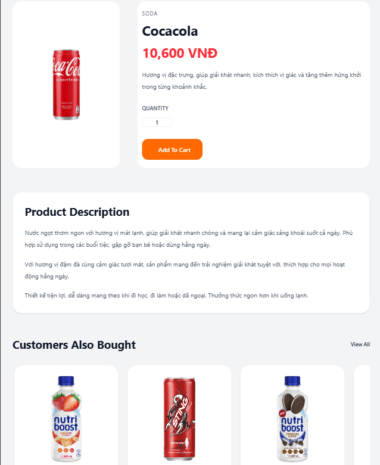
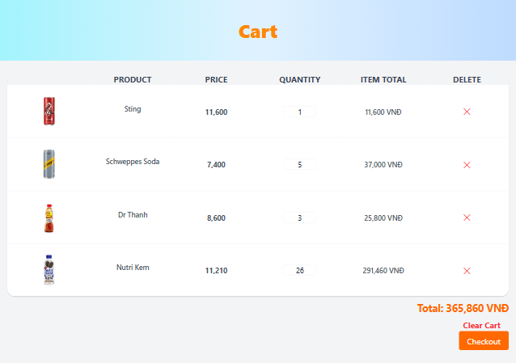
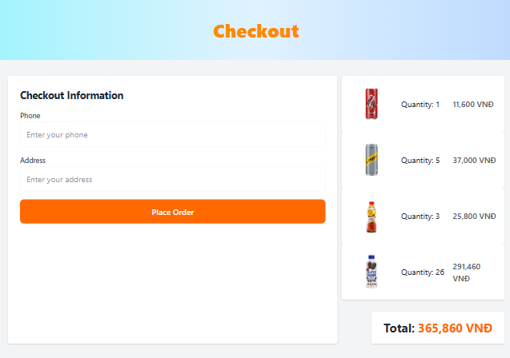
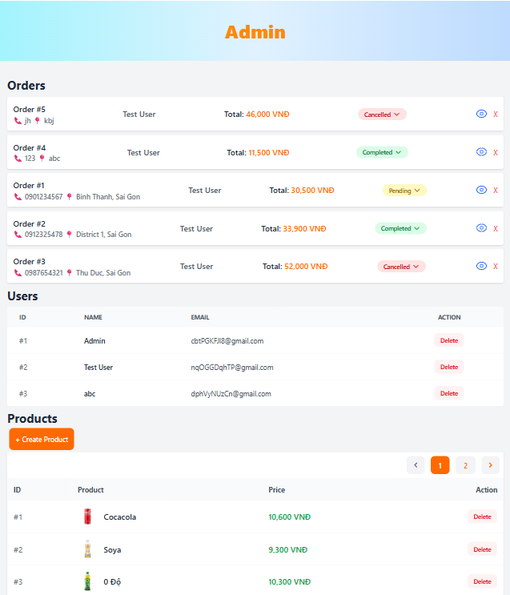

# 🛒 Laravel E-Commerce

A simple e-commerce web application.

---

# 🚀 Live Demo

👉 [View Demo](https://minishop-n4nj.onrender.com/)

---

# 📌 Features

## User Features
- Register / Login
- Browse products
- Search products
- Add to cart
- Checkout
- View order history

## Admin Features
- Product management
- Order management
- Update order status
- Dashboard statistics

---

# 🛠️ Tech Stack

- PHP 8.3
- Laravel 13
- SQLite
- Blade
- Tailwind CSS
- Vite
- Render (Deployment)

---

# 🧱 Project Architecture

The project follows Laravel MVC architecture with Service Layer pattern.

## Main Components

- Controllers
- Models
- Services
- Middleware
- Blade Views

## Service Layer

Business logic is separated into services:

- `CartService`
- `OrderService`

This keeps controllers clean and improves maintainability.

---

# 🗄️ Database Design

## Main Tables

- users
- categories
- products
- orders
- order_items

---

# 🔐 Authentication & Authorization

- Laravel Breeze Authentication
- Admin Middleware Protection

---

# 🛒 Shopping Flow

1. User browses products
2. Add products to cart
3. Checkout
4. Create order
5. Admin manages order status

---

# 📸 Screenshots

## Homepage



---

## Product Detail



---

## Cart



---

## Checkout



---

## Admin Dashboard



---

# ⚙️ Installation

## Clone repository

```bash
git clone https://github.com/your-username/your-repo.git
cd your-repo
